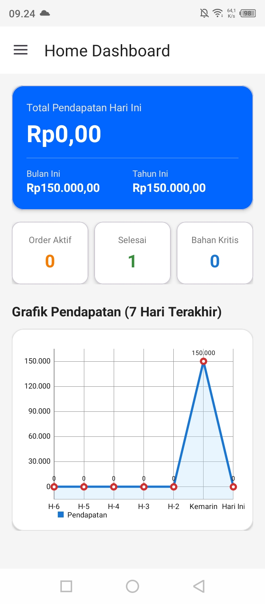
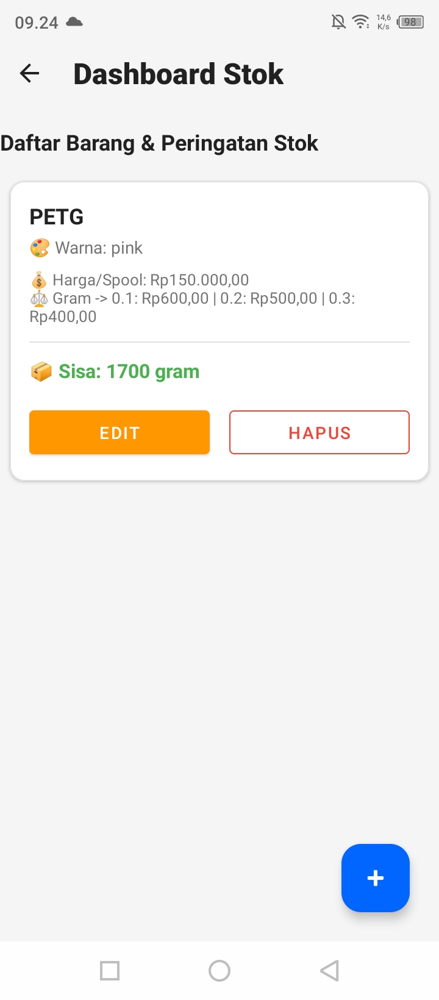
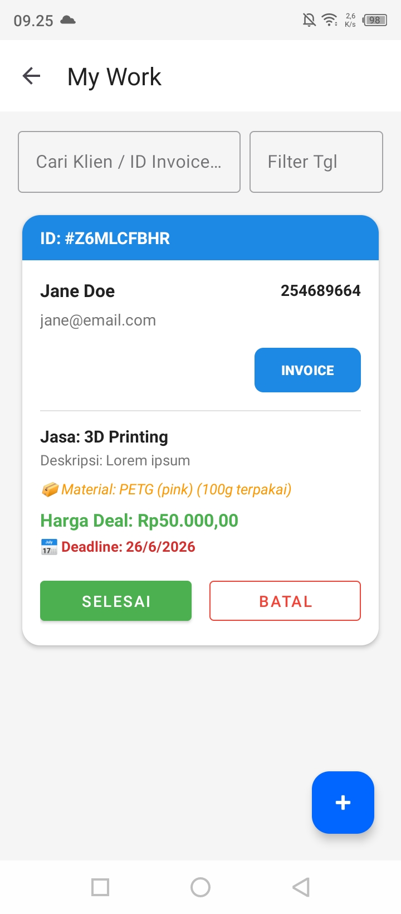
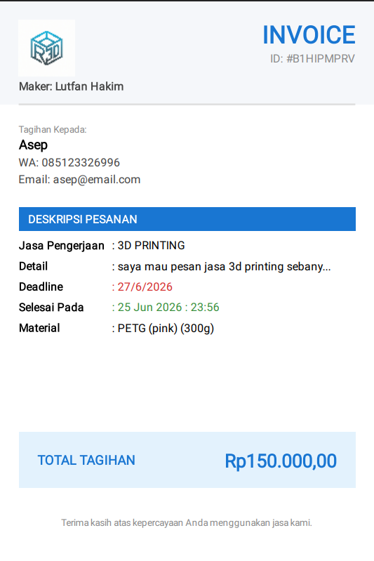

Ruang3D - Aplikasi Manajemen Workshop 3D Printing

Ruang3D adalah aplikasi Android Native yang dirancang khusus untuk mengelola operasional layanan jasa 3d Printing. Dibangun sebagai sistem manajemen (ERP mini) yang berjalan sepenuhnya secara offline, aplikasi ini membantu para maker/penyedia jasa untuk mengotomatisasi pelacakan pesanan, manajemen stok filamen, pemantauan arus kas secara real-time, hingga pembuatan invoice PDF secara otomatis.

Latar Belakang
Aplikasi ini lahir dari kebutuhan dan permasalahan nyata di lapangan. Mengelola layanan jasa 3D printing pribadi sering kali memunculkan kendala seperti: catatan pesanan yang tidak teratur, kesalahan perhitungan sisa stok bahan filament, serta pembuatan invoice manual yang memakan waktu. _Ruang3D_ dikembangkan untuk menyelesaikan masalah operasional tersebut dengan menyediakan sistem yang cepat, aman, dan mudah digunakan langsung dari ponsel.

✨Fitur Utama

*   🔐 **Arsitektur Multi-Tenant:** Menggunakan Room Database dengan pembuatan instansiasi yang dinamis. Data setiap pengguna (inventaris, pesanan, dan transaksi) diisolasi secara penuh sehingga kerahasiaan dan keamanan data terjamin.
*   📊 **Smart Dashboard & Analitik:** Menampilkan pelacakan keuangan *real-time* (Harian, Bulanan, Tahunan), grafik pendapatan 7 hari terakhir (menggunakan MPAndroidChart), serta *Smart Summary Card* yang memberikan peringatan otomatis jika stok bahan sudah mencapai batas kritis.
*   📦 **Manajemen Inventaris & Kalkulator Material:** Mengelola berbagai jenis *spool* filamen. Sistem akan secara otomatis menghitung estimasi harga jual per 0.1 gram, 0.2 gram, dan 0.3 gram berdasarkan harga dasar filamen.
*   ⚙️ **Otomatisasi Pesanan (My Work):** Melacak detail klien, deskripsi proyek, dan tenggat waktu (*deadline*). Ketika status pesanan diubah menjadi "Selesai", sistem akan otomatis memotong sisa gramasi bahan di gudang sesuai dengan jumlah yang digunakan.
*   🧾 **Generator Invoice PDF:** Membuat *invoice* PDF profesional yang siap dikirim hanya dengan satu klik. Dilengkapi dengan data dinamis, integrasi logo *brand*, dan fitur bagikan (*share*) langsung ke WhatsApp klien.
*   🗂️ **Riwayat Transaksi:** Mengarsipkan pesanan yang telah selesai atau dibatalkan, serta memperbarui *database* keuangan di latar belakang untuk analitik *dashboard*.

## 🛠️ Teknologi yang Digunakan

*   **Bahasa Pemrograman:** Java
*   **Framework:** Android SDK (Native)
*   **Database:** SQLite (Room Persistence Library)
*   **Visualisasi Data:** MPAndroidChart
*   **Pembuatan PDF:** Native Android `PdfDocument` API

## 📱 Tangkapan Layar (Screenshots)

| Dashboard & Analitik | Manajemen Stok | Pencatatan Pesanan | Hasil Invoice PDF|
| :---: | :---: | :---: | :---: |
|  |  |  |  |

## 🚀 Cara Menjalankan Aplikasi

1. Buat Akun dihalaman Login
2. Buat/tambahkan warna di menu master data warna
3. buat/tambahkan Stok di menu manajemen stok
4. tambahkan klien di menu My Work
5. Klik selesai jika sudah selesai
